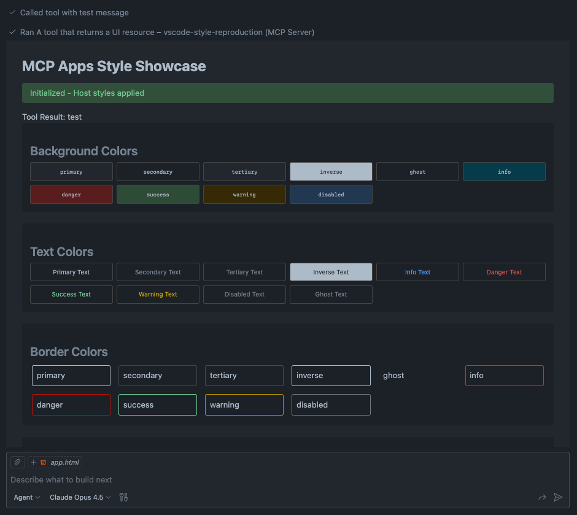
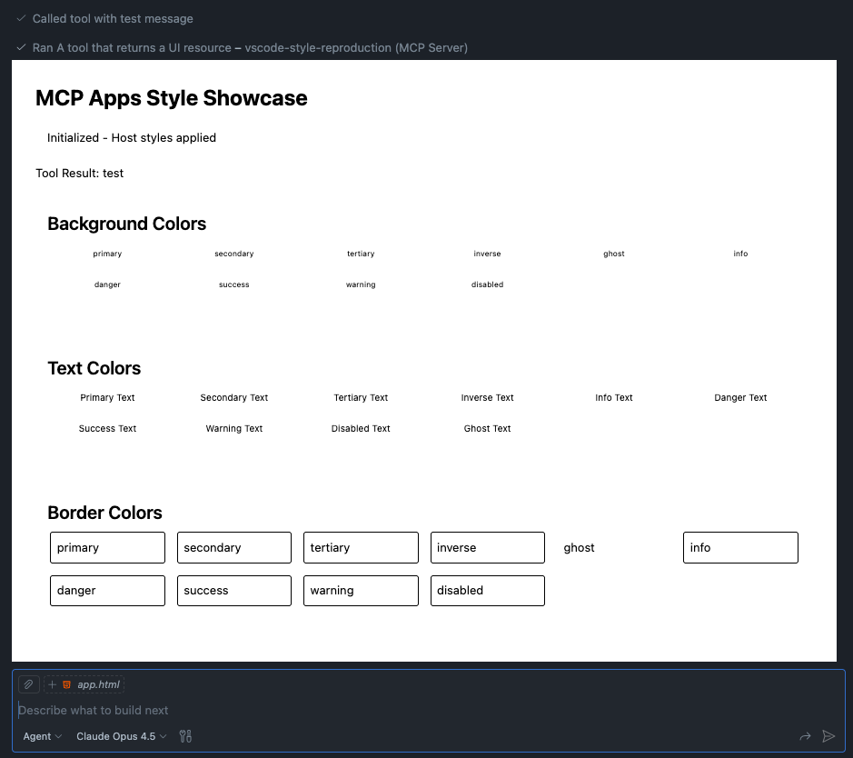

# VS Code MCP Apps Style Bug Reproduction

<video src="./media/reproductio-video.mp4" controls width="100%"></video>

> **Note:** MCP Apps UI resources are only available in **VS Code Insiders** as of 2026-01-14.

## Environment

Tested with:

```
Version: 1.109.0-insider
Commit: 5e5a439725cd83659b8b4ae5777b18731f0e99dc
Date: 2026-01-13T08:07:02.448Z
Electron: 39.2.7
ElectronBuildId: 12953945
Chromium: 142.0.7444.235
Node.js: 22.21.1
V8: 14.2.231.21-electron.0
OS: Darwin arm64 24.5.0
```

## Problem

MCP Apps CSS custom properties (from `hostContext.styles.variables`) are **not applied on initial load** of the UI resource. However, they **are correctly applied** after triggering a theme change via "Preferences: Toggle between Light/Dark Themes" command.

### Expected Behavior

When an MCP App UI resource loads, VS Code should immediately set the CSS custom properties on the `<html>` element's inline style, as it does for regular webviews (see [VS Code webview pre/index.html lines 541-556](https://github.com/microsoft/vscode/blob/84efd923012eeefafd5194fa06fe88494ebafe90/src/vs/workbench/contrib/webview/browser/pre/index.html#L541-L556)).

The MCP App should receive styles in the `ui/initialize` response's `hostContext.styles.variables` object and they should be applied to the document.

### Actual Behavior

On initial load:
- The `hostContext.styles.variables` object **is correctly populated** with values like `{ "--color-background-primary": "var(--vscode-editor-background)", ... }`
- The MCP App correctly applies these to the HTML element
- **However**, the underlying `--vscode-*` CSS custom properties (e.g., `--vscode-editor-background`) are **not set on the HTML element** by VS Code
- The CSS variables resolve to empty/undefined, so the UI renders with fallback styles only

After toggling theme:
- VS Code's `applyStyles` function runs and sets `--vscode-*` properties on the HTML element
- Now `var(--vscode-editor-background)` etc. resolve to actual color values
- The UI renders correctly with host theme colors

## Screenshots

### Expected Result (captured after theme toggle)


### Actual Result (on initial load)


## Reproduction Steps

### 1. Clone and Install

```bash
git clone <this-repo>
cd vscode-style-reproduction
npm install
```

### 2. Start the MCP Server

```bash
npm start
```

The server will start on `http://localhost:3000/mcp`

### 3. Open in VS Code

Open this folder in VS Code. The `.vscode/mcp.json` file is already configured to connect to the local MCP server.

### 4. Verify MCP Connection

Open `.vscode/mcp.json` in VS Code to ensure the MCP extension recognizes the server configuration. You should see the server status indicator.

### 5. Call the MCP Tool

In VS Code's GitHub Copilot Chat, ask:

```
Call the show-example tool with message "test"
```

### 6. Observe the Bug

1. **Initial load**: The MCP App UI appears with broken styles - the debug table shows that `--vscode-*` variables are not set on the HTML element
2. **Toggle theme**: Run command "Preferences: Toggle between Light/Dark Themes" (`Cmd+K Cmd+T` on macOS)
3. **After toggle**: The styles now work correctly - `--vscode-*` properties are set and the UI displays properly
